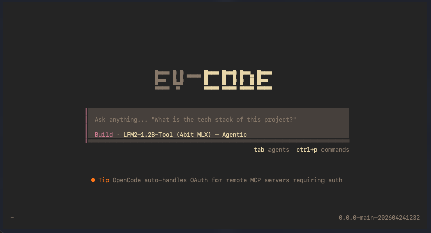

# Ey-Code: Agente de IA Local para Apple Silicon

**Language | Idioma:** [English](README.md) | [Español](README.es.md)

---

Ey-Code es un agente de IA para desarrollo de software que funciona completamente de forma local en Apple Silicon. Está basado en [opencode](https://opencode.ai) y usa modelos LiquidAI cuantizados con MLX para inferencia nativa en chips M-series.

Puede ejecutarse en modo **local** (100% offline, sin datos enviados a ningún servidor) o en modo **cloud** (usando la API de Anthropic).



---

## Requisitos

- macOS con Apple Silicon (M1 o superior)
- [Bun](https://bun.sh) 1.x — para compilar el binario
- Python 3.10+ con `pip`
- Las siguientes librerías Python:

```bash
pip install mlx-lm huggingface-hub
```

---

## Instalación

### Paso 1 — Clonar el repositorio

```bash
git clone https://github.com/jmoraleses/Ey-code.git
cd Ey-code
```

### Paso 2 — Compilar el binario

```bash
./scripts/build.sh
```

Instala las dependencias npm con Bun y compila el binario en:
`packages/opencode/dist/opencode-tahoe-arm64/bin/opencode`

### Paso 3 — Instalar en el sistema

```bash
# Instalación de usuario (recomendada, no requiere sudo)
./scripts/install-mac.sh

# Instalación global en /usr/local/bin (requiere sudo)
./scripts/install-mac.sh --system
```

El instalador coloca en `~/.local/bin/` (o `/usr/local/bin/` con `--system`):
- `ey-code` — lanzador principal (gestiona los servidores MLX automáticamente)
- `opencode` — alias de `ey-code`
- `ey-code-download-models` — descargador de modelos

Y en `~/.config/ey-code/`:
- `opencode.json` — configuración global
- `AGENTS.md` — identidad del agente
- `skills/` — habilidades especializadas

Si instalas en `~/.local/bin`, añade esa ruta a tu PATH si no está ya:

```bash
echo 'export PATH="$HOME/.local/bin:$PATH"' >> ~/.zshrc
source ~/.zshrc
```

### Paso 4 — Descargar los modelos

```bash
ey-code-download-models
```

Descarga los cuatro modelos MLX en `~/Documents/.eycode/models/`:

| Modelo | Tamaño | Fuente (HuggingFace) | Uso |
|---|---|---|---|
| `LFM2-350M-4bit` | ~195 MB | `mlx-community/LFM2-350M-4bit` | Tareas ligeras del sistema (títulos, compactación) |
| `LFM2.5-1.2B-Instruct-4bit` | ~633 MB | `mlx-community/LFM2.5-1.2B-Instruct-4bit` | Agente `coder` — programación e instrucciones |
| `LFM2-1.2B-Tool-MLX-4bit` | ~633 MB | `Unravler/LFM2-1.2B-Tool-MLX-4bit` | Agente `build` (**por defecto**) — tool-calling |
| `LFM2-350M-Math-MLX-4bit` | ~200 MB | `nightmedia/LFM2-350M-Math-mxfp4-mlx` | Agente `math` — matemáticas y ciencia |

Cada modelo se carga en RAM únicamente cuando su agente es utilizado. El script omite los ya descargados. Opciones adicionales:

```bash
# Forzar re-descarga de todos los modelos
ey-code-download-models --force

# Con token de HuggingFace (si algún repo lo requiere)
HF_TOKEN=hf_xxx ey-code-download-models
```

### Paso 5 — Lanzar Ey-Code

```bash
ey-code
```

Al iniciar, el lanzador arranca automáticamente los servidores MLX necesarios. Al salir con Ctrl+D, los servidores se detienen y la memoria RAM queda libre.

---

## Uso

```bash
# Modo local (MLX, 100% offline)
ey-code

# Modo cloud (API de Anthropic — requiere ANTHROPIC_API_KEY)
ey-code --cloud

# Continuar una sesión anterior
ey-code -s <session-id>

# Ayuda
ey-code --help
```

Para enviar una tarea directamente desde la línea de comandos:

```bash
ey-code run "Crea un servidor HTTP básico en Python"
```

---

## Arquitectura de modelos y agentes

Ey-Code arranca cuatro proxies MLX con la API OpenAI-compatible. Todos son **lazy**: cada modelo se carga en RAM únicamente cuando su agente recibe su primera petición, y se libera al salir.

| Puerto | Modelo | Rol |
|---|---|---|
| 8080 | LFM2-350M-4bit | `small_model`: títulos, compactación, tareas ligeras del sistema |
| 8081 | LFM2.5-1.2B-Instruct-4bit | Agente `coder` — programación e instrucciones |
| 8082 | LFM2-1.2B-Tool-MLX-4bit | Agente `build` (**por defecto**) — tool-calling agentico |
| 8083 | LFM2-350M-Math-MLX-4bit | Agente `math` — matemáticas y análisis científico |

Los backends reales de los modelos se inician en los puertos `+10000` (18080–18083) y son gestionados por el proxy lazy.

### Agentes disponibles

| Agente | Modelo | Modo | Descripción |
|---|---|---|---|
| `build` | LFM2-1.2B-Tool | primary (por defecto) | Desarrollo general, crea y edita archivos |
| `coder` | LFM2.5-1.2B-Instruct | primary | Programación e instrucciones detalladas |
| `math` | LFM2-350M-Math | primary | Cálculos matemáticos y análisis científico |
| `researcher` | LFM2-350M | subagent | Búsqueda y análisis de información |
| `pentester` | LFM2-1.2B-Tool | subagent | Auditoría de seguridad (scope ético) |

### Skills integradas

Las skills son conjuntos de instrucciones especializadas que el agente carga según la tarea:

- `coding-agent` — Flujo completo de desarrollo de software
- `auto-test` — Generación y ejecución de tests
- `project-implementation` — Implementación de proyectos desde especificación
- `research-mode` — Investigación en profundidad
- `ai-math-research` — Análisis matemático y científico
- `pentesting-chat` — Auditoría de seguridad guiada
- `karpathy-guidelines` — Mejores prácticas de ML/IA
- `tool-builder` — Creación de nuevas herramientas MCP
- `skill-creator` — Creación de nuevas skills
- `ey-agent-core` — Comportamiento base del agente

---

## Modo desarrollo (sin instalar)

Para ejecutar Ey-Code directamente desde el repositorio sin instalar:

```bash
# 1. Compilar
./scripts/build.sh

# 2. Arrancar los servidores MLX
./scripts/start-mlx.sh

# 3. Lanzar Ey-Code
./scripts/start.sh

# Modo cloud (sin modelos locales)
./scripts/start.sh --cloud
```

Al salir de `./scripts/start.sh`, los servidores MLX se detienen automáticamente si fueron iniciados por esa sesión.

---

## Configuración

### Configuración global (tras instalar)

`~/.config/ey-code/opencode.json` — modelo activo, agentes y proveedores.

### Configuración de proyecto

`opencode.json` en la raíz del repositorio con el que trabajes — tiene prioridad sobre la configuración global.

### Variables de entorno

| Variable | Descripción |
|---|---|
| `ANTHROPIC_API_KEY` | Necesaria para el modo `--cloud` |
| `EY_CODE_MODELS_DIR` | Ruta alternativa para los modelos (por defecto `~/Documents/.eycode/models`) |

### Rutas relevantes

| Ruta | Contenido |
|---|---|
| `~/Documents/.eycode/models/` | Modelos MLX descargados |
| `~/.config/ey-code/` | Configuración global, skills, AGENTS.md |
| `~/.local/state/ey-code/` | Logs de los servidores MLX |

---

## Estructura del repositorio

```
Ey-code/
├── packages/
│   └── opencode/          # Núcleo del agente (fork de opencode)
├── scripts/
│   ├── build.sh           # Compilación del binario con Bun
│   ├── install-mac.sh     # Instalación en macOS
│   ├── start.sh           # Lanzador de desarrollo (sin instalar)
│   ├── start-mlx.sh       # Arranque manual de servidores MLX
│   ├── download-models.sh # Descarga de modelos desde Hugging Face
│   ├── lazy-mlx.py        # Proxy lazy para carga bajo demanda de modelos
│   └── ey-code-wrapper.sh # Wrapper instalado como `ey-code`
├── skills/                # Skills especializadas del agente
├── opencode.json          # Configuración del proyecto
├── AGENTS.md              # Identidad y comportamiento del agente
└── assets/
    └── screenshot.png
```

---

## Compilar la aplicación de escritorio (opcional)

Ey-Code incluye una app Electron nativa para macOS:

```bash
cd packages/desktop-electron
bun install
bun run build
bun run package:mac
```

El instalador `.dmg` se genera en `packages/desktop-electron/dist/`.
